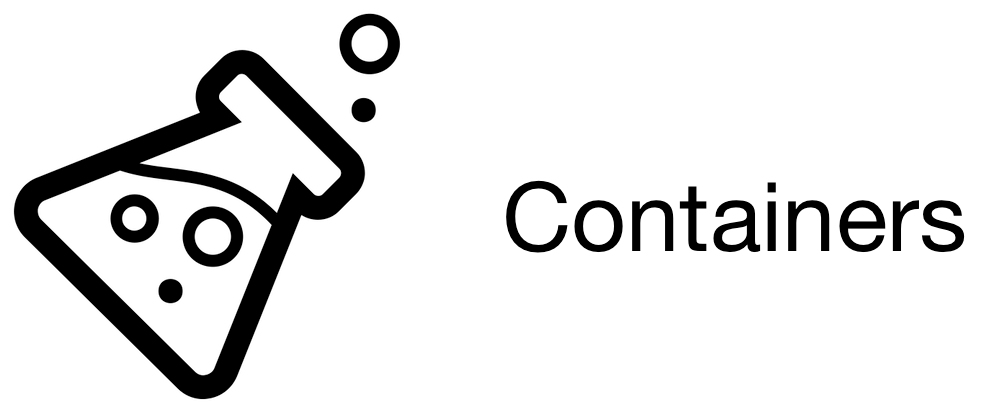

# Container ontology
Container ontology for use with [PAML (Protocol Activity Markup Language)](https://github.com/Bioprotocols/PAML-specification) and the [PAML library](https://github.com/Bioprotocols/paml).

The intent is to supply an ontology of OWL classes and individuals that can be used to specify required containers for use in biology protocols specified in PAML.

There are OWL classes for concepts such as `Standard96Wellplate`.  These should be used to specify requirements (e.g., `Standard96WellPlate and ClearPlate`) in a protocol that may be met by multiple different sorts of plate.  OWL individuals are used for specific *types* of plate such as a Corning 3632 (`Corning3632`).  The decision was made to represent these basic types as Individuals so that it would be readily detectable when the process of choosing a matching container was complete (one or more individuals have been found that match the requirements).

# Status

The container ontology is very much in flux at the moment.  We provide a proof of concept of its utility by capturing  the contents of [Strateos](https://strateos.com)'s online catalog of containers (Strateos is a prominent cloud lab).  We also provide a server, based on a Docker container, that you can use to query the ontology, and a Python library for automating such queries.


We first describe the server, which is build on Owlery, and then we discuss how to use the Python library that provides query servicing for the server.

## Important Note

Note that the final ontology IRI has still not been chosen: we are identifying how best to provide a stable IRI from which the ontology can be retrieved reliably.  If you are referring to this ontology, we strongly urge you to use a prefix definition (we use `cont`) for the ontology, so that any documents you create can be easily updated.

# The Container Server

## Start Queryable Server

To retrieve entities (for now, this really only works for Plates), you may do the following:

    cd owl
    make server
    
This will start an [Owlery](https://github.com/phenoscape/owlery) server on localhost, listening on port 8080.  (If you would prefer a different port, you can do, for example, `make HOST_PORT=80 server`.

### Interactive UI

A rudimentary UI is provided,based on the Swagger/OpenAPI spec on the resulting server.  To try it, aim your browser at `http://localhost:8080/docs/index.html` (assuming your server is running on port 8080 on the local host).

### Making Queries

From here, you should be able to execute queries such as the following:

    curl -G --location --request GET 'http://localhost:8080/kbs/sd2e-container-catalogs/instances' --data "kb=sd2e-container-catalogs" --data-urlencode "object=cont:Plate"   --data 'direct=false' --data-urlencode 'prefixes={ "owl" :  "http://www.w3.org/2002/07/owl#", "cont": "https://sift.net/container-ontology/container-ontology#"}'

Some explanation:

* The base of the target URL, `http://localhost:8080/kbs/`, indicates the server.

* The next URL component indicates the Owlery knowledge base that is available.  At the moment, only the `strateos-catalog` knowledge base is supplied on this server.

* The next part of the url indicates that the query is for `instances`.  Other queries include `types` and `subclasses`.  See https://owlery.phenoscape.org/api/ for more details about the API.

* Finally, there are arguments encoded as HTTP GET parameters:

    * `kb=strateos-catalog` I am not sure why Owlery requires this in addition to the path component; just do it.
    * `object=cont:Plate` The object argument indicates the class whose instances you want.  Note that the argument here must be *URL-encoded*.
    * `prefixes=...` This is a set of prefix definitions, encoded as JSON: an object whose keys (`"cont"` and `"owl"`) are prefixes (*without* the trailing colon), and whose values are IRI prefixes (*with* the trailing hash-mark).  Again, this must be URL-encoded.
    * `direct=false` We want *all* instances of `cont:Plate`, not just direct instances.
    
The results will come back as a JSON Object whose keys are:

* `@id`: The IRI for the class whose instances are being returned.
* `hasInstance`: A JSON array of Individual IRIs.
* `context`: No idea what this means.

For example:

    {
        "@id": "https://raw.githubusercontent.com/rpgoldman/container-ontology/owlery-server/owl/container-ontology.ttl#Plate",

        "hasInstance": [
            "https://raw.githubusercontent.com/rpgoldman/container-ontology/owlery-server/owl/strateos-catalog.ttl#Mesoscale96-10-spot-uplex-MSD",
            "https://raw.githubusercontent.com/rpgoldman/container-ontology/owlery-server/owl/strateos-catalog.ttl#Corning384-flat-white-clear",
            "https://raw.githubusercontent.com/rpgoldman/container-ontology/owlery-server/owl/strateos-catalog.ttl#Eppendorf6-flat-tc",
            "https://raw.githubusercontent.com/rpgoldman/container-ontology/owlery-server/owl/strateos-catalog.ttl#Mesoscale96-10-spot-vplex-m-pro-inflamm1-MSD",
            "https://raw.githubusercontent.com/rpgoldman/container-ontology/owlery-server/owl/strateos-catalog.ttl#Corning384-flat-white-white-tc",
            "https://raw.githubusercontent.com/rpgoldman/container-ontology/owlery-server/owl/strateos-catalog.ttl#Eppendorf6-flat",
            "https://raw.githubusercontent.com/rpgoldman/container-ontology/owlery-server/owl/strateos-catalog.ttl#Eppendorf96-pcr",
            "https://raw.githubusercontent.com/rpgoldman/container-ontology/owlery-server/owl/strateos-catalog.ttl#Sumitomo%20Bakelite%20Co.384-ubottom-white-tc",
            "https://raw.githubusercontent.com/rpgoldman/container-ontology/owlery-server/owl/strateos-catalog.ttl#Corning96-deep",
            "https://raw.githubusercontent.com/rpgoldman/container-ontology/owlery-server/owl/strateos-catalog.ttl#Corning384-round-clear-clear",
            "https://raw.githubusercontent.com/rpgoldman/container-ontology/owlery-server/owl/strateos-catalog.ttl#Corning384-flat-white-white-nbs",
            "https://raw.githubusercontent.com/rpgoldman/container-ontology/owlery-server/owl/strateos-catalog.ttl#Corning96-flat-uv",
            "https://raw.githubusercontent.com/rpgoldman/container-ontology/owlery-server/owl/strateos-catalog.ttl#Mesoscale96-4-spot-mMIP3a-MSD",
            "https://raw.githubusercontent.com/rpgoldman/container-ontology/owlery-server/owl/strateos-catalog.ttl#Eppendorf384-pcr",
            "https://raw.githubusercontent.com/rpgoldman/container-ontology/owlery-server/owl/strateos-catalog.ttl#Fisher96-vbottom-microwell",
            "https://raw.githubusercontent.com/rpgoldman/container-ontology/owlery-server/owl/strateos-catalog.ttl#PerkinElmer384-flat-white-white-optiplate",
            "https://raw.githubusercontent.com/rpgoldman/container-ontology/owlery-server/owl/strateos-catalog.ttl#Eppendorf96-flat-clear-clear-tc",
            "https://raw.githubusercontent.com/rpgoldman/container-ontology/owlery-server/owl/container-ontology.ttl#EnduraPlate_96Well_Red",
            "https://raw.githubusercontent.com/rpgoldman/container-ontology/owlery-server/owl/strateos-catalog.ttl#ThermoFisher96-flat-white-dc",
            "https://raw.githubusercontent.com/rpgoldman/container-ontology/owlery-server/owl/strateos-catalog.ttl#Fisher96-v-kf",
            "https://raw.githubusercontent.com/rpgoldman/container-ontology/owlery-server/owl/strateos-catalog.ttl#PerkinElmer384-flat-black-black-proxiplate-plus-f",
            "https://raw.githubusercontent.com/rpgoldman/container-ontology/owlery-server/owl/strateos-catalog.ttl#Costar96-flat-clear-costar-3590",
            "https://raw.githubusercontent.com/rpgoldman/container-ontology/owlery-server/owl/strateos-catalog.ttl#ThermoFisher384-ubottom-clear-polypropylene-nunc-264573",
            "https://raw.githubusercontent.com/rpgoldman/container-ontology/owlery-server/owl/strateos-catalog.ttl#Axygenres-mw8-hp",
            "https://raw.githubusercontent.com/rpgoldman/container-ontology/owlery-server/owl/strateos-catalog.ttl#Corning384-flat",
            "https://raw.githubusercontent.com/rpgoldman/container-ontology/owlery-server/owl/container-ontology.ttl#EnduraPlate_96Well_Yellow",
            "https://raw.githubusercontent.com/rpgoldman/container-ontology/owlery-server/owl/strateos-catalog.ttl#Chemspeedchemspeed-96-sealed-pin-rack",
            "https://raw.githubusercontent.com/rpgoldman/container-ontology/owlery-server/owl/strateos-catalog.ttl#Corning1536-tc-white-corning-3727",
            "https://raw.githubusercontent.com/rpgoldman/container-ontology/owlery-server/owl/strateos-catalog.ttl#Greiner96-flat-black-black-fluotrac-600",
            "https://raw.githubusercontent.com/rpgoldman/container-ontology/owlery-server/owl/strateos-catalog.ttl#Axygenres-mw12-hp",
            "https://raw.githubusercontent.com/rpgoldman/container-ontology/owlery-server/owl/strateos-catalog.ttl#PerkinElmer384-flat-white-white-proxiplate-plus",
            "https://raw.githubusercontent.com/rpgoldman/container-ontology/owlery-server/owl/strateos-catalog.ttl#Corning384-flat-white-white-lv",
            "https://raw.githubusercontent.com/rpgoldman/container-ontology/owlery-server/owl/strateos-catalog.ttl#Corning96-flat",
            "https://raw.githubusercontent.com/rpgoldman/container-ontology/owlery-server/owl/strateos-catalog.ttl#Corning96-ubottom-clear-tc",
            "https://raw.githubusercontent.com/rpgoldman/container-ontology/owlery-server/owl/strateos-catalog.ttl#E%26K%20Scientific24-deep",
            "https://raw.githubusercontent.com/rpgoldman/container-ontology/owlery-server/owl/strateos-catalog.ttl#Corning384-round-black-black-lv-nbs",
            "https://raw.githubusercontent.com/rpgoldman/container-ontology/owlery-server/owl/container-ontology.ttl#EnduraPlate_96Well_Blue",
            "https://raw.githubusercontent.com/rpgoldman/container-ontology/owlery-server/owl/strateos-catalog.ttl#Corning384-flat-clear-clear",
            "https://raw.githubusercontent.com/rpgoldman/container-ontology/owlery-server/owl/strateos-catalog.ttl#Fisher96-deep-kf",
            "https://raw.githubusercontent.com/rpgoldman/container-ontology/owlery-server/owl/container-ontology.ttl#EnduraPlate_96Well_Clear",
            "https://raw.githubusercontent.com/rpgoldman/container-ontology/owlery-server/owl/strateos-catalog.ttl#Greiner384-v-clear-clear",
            "https://raw.githubusercontent.com/rpgoldman/container-ontology/owlery-server/owl/strateos-catalog.ttl#Labcyte384-echo",
            "https://raw.githubusercontent.com/rpgoldman/container-ontology/owlery-server/owl/strateos-catalog.ttl#Greiner1536-white-tc",
            "https://raw.githubusercontent.com/rpgoldman/container-ontology/owlery-server/owl/strateos-catalog.ttl#Corning96-well-v-bottom",
            "https://raw.githubusercontent.com/rpgoldman/container-ontology/owlery-server/owl/container-ontology.ttl#EnduraPlate_96Well_Multicolor",
            "https://raw.githubusercontent.com/rpgoldman/container-ontology/owlery-server/owl/strateos-catalog.ttl#Labcyte384-echo-ldv"
        ],

        "@context": "https://owlery.phenoscape.org/json/context.jsonld"
    }

For a slightly more complex query, one could try:

`--data-urlencode "object=cont:Plate and cont:availableAt value cont:Strateos"`

or

`--data-urlencode "object=cont:Standard96wellplate"`

# The Python API for the Container Server

To install this library into python (we recommend using a dedicated virtual environment),
assuming that your current working directory is the directory of the container-ontology git
repo, you may simply do:

```
pip install -e .
```

This will give you access to the `container_api` Python library.  In order for this
to run successfully, *the container server must be up and running*.  At the moment, it
is up to the user to start the server manually.

For an example of how to use the server, see the `main` procedure in [client_api.py](src/container_api/client_api.py)

To try it out, you can just do:

```
python -m container_api.client_api
```

in a virtual environment with this system `pip`-installed, as above.

## More Documentation to Follow...
